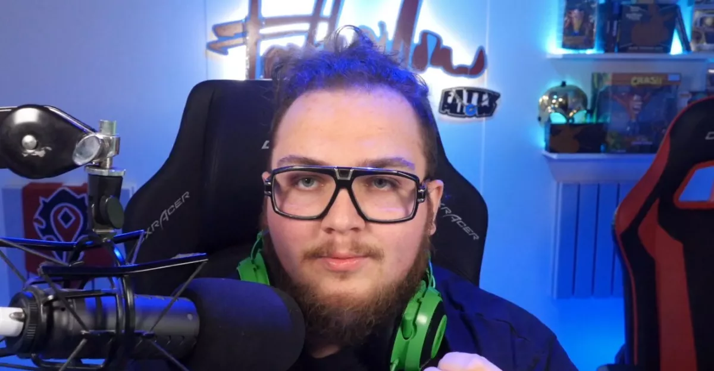
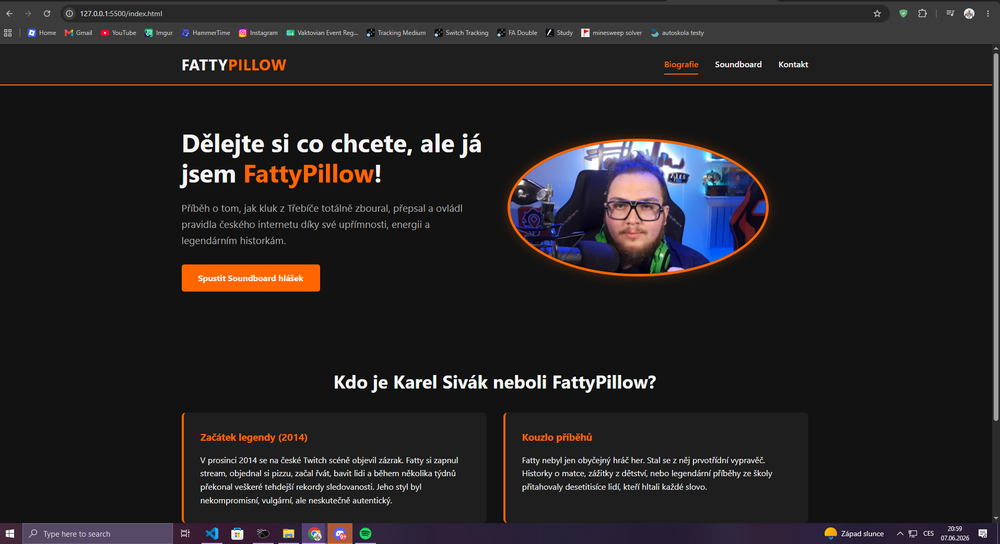
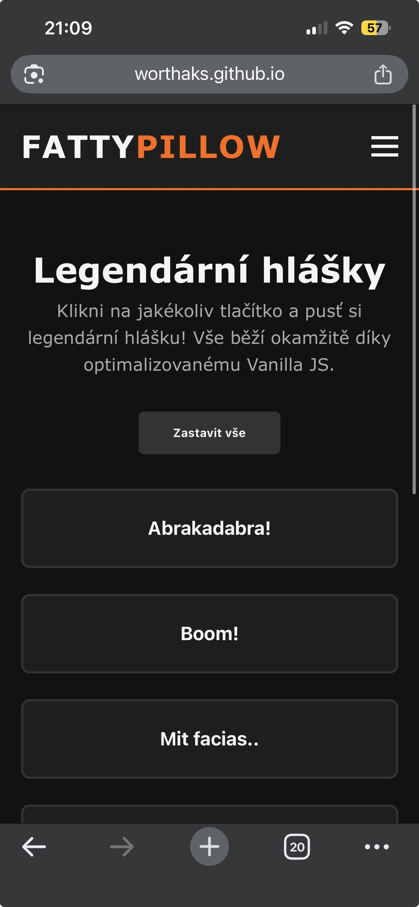

# Ročníková práce: Moderní webová prezentace – FattyPillow

* **Předmět:** Webové technologie (2. ročník)
* **Téma:** FattyPillow (Karel Sivák) – Neoficiální fanouškovská prezentace a soundboard
* **Živý web:** [https://Worthaks.github.io/fattypillow-prezentace/](https://Worthaks.github.io/fattypillow-prezentace/)

---

## Úvod
Tato ročníková práce představuje moderní, plně optimalizovanou webovou prezentaci určená jedné pro jednu z nejvýraznějších osobností české streamovací komunity – Karlu Sivákovi (FattyPillow). Web slouží jako fanoušsková stránka obsahující autorovu biografii, interaktivní soundboard s legendárními hláškami a (ne úplně fungující) kontaktní formulář.

Projekt je postaven na principech **Vanilla přístupu** (čisté technologie bez frameworků) s důrazem na čistý kod, sémantiku, WCAG a maximální rychlost načítání.

---

## Použité technologie
* **HTML5:** Sémantické značkování struktury stránek.
* **CSS3:** Flexbox a CSS Grid pro responzivní layout, CSS Custom Properties (proměnné) pro správu design systému.
* **Vanilla JavaScript (ES6+):** Správa DOM, validace formulářů, asynchronní chování a obsluha audio elementů.
* **IDE:** Visual Studio Code (v1.85+) s rozšířením Live Server pro lokální ladění.

---

## Adresářová struktura

fattypillow-prezentace/
│
├── index.html               # Hlavní stránka (Biografie)
├── soundboard.html          # Interaktivní soundboard se zvuky
├── kontakt.html             # Kontaktní formulář a odkazy na sítě
│
├── css/
│   ├── variables.css        # Globální CSS proměnné (barvy, fonty)
│   ├── style.css            # Hlavní layout a styly komponent
│   └── responsive.css       # Media queries (Mobile First přístup)
│
├── js/
│   ├── main.js              # Globální skripty (hamburger menu)
│   └── soundboard.js        # Logika soundboardu (Event Delegation)
│
├── assets/
│   ├── images/              # Optimalizované obrázky ve formátu .webp
│   └── audio/               # Zvukové stopy pro soundboard (.mp3)
│
├── robots.txt               # Soubor s instrukcemi pro vyhledávače
├── sitemap.xml              # Mapa stránek pro indexaci vyhledávači
└── README.md                # Tato dokumentace

---

## Technický rozbor oblasti optimalizace

1. Výkon (Performance)
Výkon webu je optimalizován minimalizací HTTP požadavků spojením stylů a odloženým načítáním skriptů (defer). Všechny grafické podklady byly zkonvertovány do moderního formátu .webp, který oproti PNG/JPG snižuje datový objem o více než 60 % při zachování vizuální kvality. U obrázků jsou striktně definovány rozměry (width, height), čímž se předchází nežádoucímu posunu obsahu (CLS – Cumulative Layout Shift).

Code Snippet:

HTML

2. SEO (Search Engine Optimization)
Teoretický popis: Web je plně sémantický (používá tagy jako <header>, <main>, <section>, <article>). Každá podstránka má unikátní titulek a meta popis. Pro roboty vyhledávačů byl vytvořen validní soubor sitemap.xml a robots.txt. Do hlavičky webu byla navíc implementována strukturovaná data ve formátu JSON-LD (schéma typu Person), která vyhledávačům srozumitelně předávají informace o subjektu stránky.

Code Snippet:

HTML

3. Přístupnost (Accessibility)
Teoretický popis: Kontrastní poměr textu vůči tmavému pozadí splňuje požadavky normy WCAG 2.1 na úrovni AA (poměr větší než 4.5:1). Web je plně ovladatelný pomocí klávesnice (tabulátor). Tlačítka na soundboardu a interaktivní prvky jsou osazeny atributy aria-label, aby byly srozumitelné pro uživatele se zrakovým postižením využívající čtečky obrazovky.

Code Snippet:

HTML
<button class="sound-btn" 
        data-sound="tlustej-burt" 
        aria-label="Přehrát Fattyho hlášku: Tlustej buřt">
    Tlustej Buřt!
</button>

4. Sociální sítě
Teoretický popis: Pro zajištění atraktivního vzhledu při sdílení odkazů na sociálních sítích (Facebook, Discord, X/Twitter) byly implementovány protokoly Open Graph a Twitter Cards. Vyhledávače a boti sociálních sítí tak dokáží přesně vygenerovat náhledovou kartu s vlastním obrázkem, titulkem a popiskem.

Code Snippet:

HTML
<meta property="og:type" content="website">
<meta property="og:title" content="FattyPillow - Legenda českého Twitchi">
<meta property="og:description" content="Vše o FattyPillowovi na jednom místě. Biografie, interaktivní soundboard a legendární hlášky.">
<meta property="og:image" content="[https://Worthaks.github.io/fattypillow-prezentace/assets/images/og-prehled.jpg](https://Worthaks.github.io/fattypillow-prezentace/assets/images/og-prehled.jpg)">
<meta name="twitter:card" content="summary_large_image">

5. UI/UX & Responzivita
Teoretický popis: Web je navržen moderní metodou Mobile First. Rozvržení stránek se flexibilně přizpůsobuje od nejmenších displejů mobilních telefonů až po velké monitory za pomoci CSS Grid a Flexboxu. Navigační menu se na mobilních zařízeních transformuje do dotykově přívětivého „hamburger“ menu. Barevné schéma (oranžová a tmavé tóny) odráží vizuální identitu FattyPillowa a atmosféru platformy Twitch.

Code Snippet:

CSS
.soundboard-grid {
    display: grid;
    grid-template-columns: repeat(auto-fit, minmax(180px, 1fr));
    gap: 1.5rem;
}
@media (max-width: 768px) {
    .soundboard-grid {
        grid-template-columns: repeat(auto-fit, minmax(130px, 1fr));
        gap: 1rem;
    }
}

## AI Deník

Při tvorbě projektu jsem používal AI jako konzultanta, generování textů a návrh struktury SEO.

Použité prompty a jejich přínos:

Prompt 1 (Návrh webu):
"Ahoj, mam pro tebe jeden projekt, chtel bych aby jsi mi s tim pomohl a konzultoval se mnou co by jsi tam pridal, co se ti tam nelibi, atd.." (Připnutí txt souboru s návrhem webu)

Přínos AI: AI navrhnula perfektní web, jak by mohl vypadat, co by mohlo být zajímavé jako například soundboard hlášek

Prompt 2 (Zakázaní JS frameworků, CSS frameworků):
"Mohl by jsi prosim upravit web aby nepouzival js framework a css framework?"

Přínos AI: AI upravila kod tak, aby obešla používání JS a CSS frameworky.

Prompt 3 (Strukturovaná data):
"Vytvor k tomu jeste json ld script pro web o znamem streamerovi ceske komunity internetu, streamer se jmenuje Karel Sivak, vystupuje pod prezdivkou FattyPillow, pracuje jako streamer a influencer v Ceske republice a pouziva Twitch a YouTube."

Přínos AI: Generování bezchybné SEO sémantiky na první dobrou. Odstranilo se riziko ručního psaní složitých závorek v JSON struktuře.

## Instalace a spuštění
Naklonujte repozitář do lokálního adresáře:

Bash
   git clone [https://github.com/Worthaks/fattypillow-prezentace.git](https://github.com/Worthaks/fattypillow-prezentace.git)
Otevřete složku projektu v editoru Visual Studio Code.

Spusťte projekt pomocí rozšíření Live Server (kliknutím na tlačítko Go Live v pravém dolním rohu editoru).

Web se automaticky otevře ve vašem lokálním prohlížeči na adrese http://127.0.0.1:5500/.

## Galerie
(Zde student po dokončení doplní reálné screenshoty ze svého projektu)

Desktop verze: 

Mobilní verze (Soundboard): 